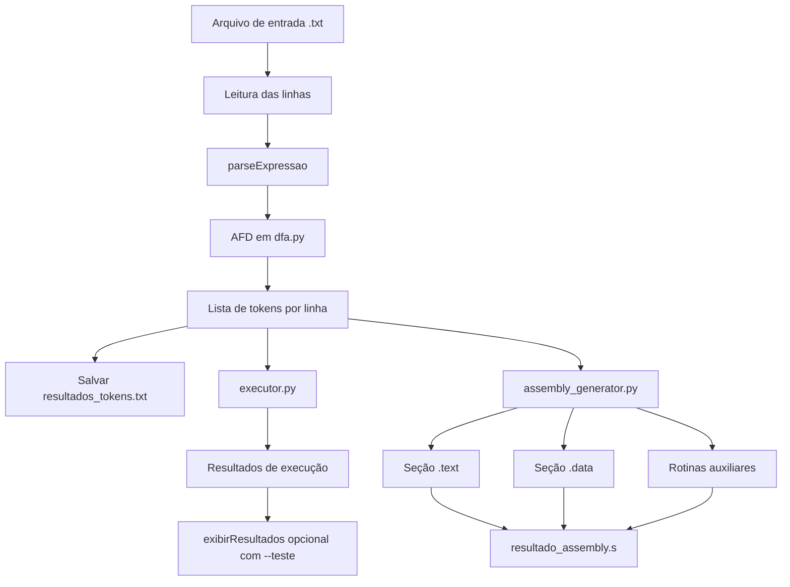

# Analisador Léxico e Gerador de Assembly para ARMv7 

# Funcionamento

## Executar o Analisador Léxico

```bash
python3 main.py <arquivo>.txt
```

Exemplo:
```bash
python3 main.py teste.txt
```

Saída esperada:
```
Tokens salvos em: resultados_tokens.txt

Arquivo de tokens gerado: resultados_tokens.txt
Arquivo Assembly gerado: resultado_assembly.s
```

## Testes Unitários

- Reconhecimento de números (inteiros, decimais, negativos)
- Validação de operadores (+, -, *, /, //, %, ^)
- Reconhecimento de parênteses
- Palavras especiais (RES, MEM)
- Expressões completas em notação RPN
- Detecção de erros léxicos
- Validação de delimitadores

### Executar todos os testes

```bash
python3 -m unittest test_dfa -v
```

### Executar testes de uma categoria específica

```bash
# Apenas testes de números
python3 -m unittest test_dfa.TestDFANumeros -v

# Apenas testes de operadores
python3 -m unittest test_dfa.TestDFAOperadores -v

# Apenas testes de erros léxicos
python3 -m unittest test_dfa.TestDFAErrosLexicos -v
```

### Executar um teste específico

```bash
python3 -m unittest test_dfa.TestDFANumeros.test_numero_decimal -v
```

## Estrutura do projeto

```text
ra1_4/
├── main.py
├── dfa.py
├── executor.py
├── assembly_generator.py
├── test_dfa.py
├── arquivo1.txt
├── arquivo2.txt
├── arquivo3.txt
├── resultado_assembly.s
└── resultados_tokens.txt
```

### Responsabilidade de cada módulo

- `main.py`: fluxo principal (ler arquivo, tokenizar, executar, gerar assembly e salvar saídas)
- `dfa.py`: analisador léxico com Autômato Finito Determinístico (estados implementados por funções)
- `executor.py`: execução das expressões em memória de teste (pilha, histórico, variáveis)
- `assembly_generator.py`: tradução dos tokens para Assembly ARMv7
- `test_dfa.py`: testes unitários do analisador léxico

## Fluxo geral

1. Lê o arquivo de entrada passado por argumento.
2. Tokeniza cada linha com o AFD (`parseExpressao`).
3. Salva os tokens em `resultados_tokens.txt`.
4. Executa as expressões no executor para validação local.
5. Gera código Assembly ARMv7 com base nos tokens.
6. Salva o assembly final em `resultado_assembly.s`.

## Diagrama Mermaid



## Decisões estratégicas adotadas

### 1) Separação entre validação local e cálculo final

Mesmo com execução local em Python para conferência de fluxo, a geração de Assembly é mantida como etapa principal para o resultado final no ambiente ARMv7.

### 2) AFD com estados em funções

A implementação léxica foi estruturada em funções de estado (`estado_inicial`, `estado_numero`, `estado_operador`, etc.), atendendo explicitamente ao requisito do trabalho e facilitando depuração.

### 3) Estratégia para expressões aninhadas

A redução é feita sempre pelo bloco mais interno entre parênteses, permitindo tratar aninhamento arbitrário de forma incremental.

### 4) Histórico e memória como estruturas explícitas

Foram usadas estruturas separadas para:

- histórico de resultados (suporte a `N RES`)
- memória nomeada (suporte a `V MEM` e `MEM`)

Isso mantém o comportamento previsível e compatível com o escopo por arquivo.

### 5) Rotinas auxiliares no assembly

Operações não triviais no ARMv7 (como divisão inteira, módulo e potenciação) foram organizadas em rotinas auxiliares para manter o código gerado legível e reutilizável.

## 6) Representação de números no display utilizando '_'

Escolhi por representar no display de 7 segmentos a parte inteira da fracionária com um underline (_) devido ao meu desconhecimento de como acionar o ponto.

## 7) Segregação dos grandes blocos em pequenas funções

Tentei separar os blocos principais de código em pequenas funções que me permitem realizar ajustes em pontos específicos da implementação caso haja necessidade.

## Execução com e sem exibição de resultados

### Modo padrão

```bash
python3 main.py arquivo1.txt
```

Gera os arquivos de saída (`resultados_tokens.txt` e `resultado_assembly.s`) sem imprimir os resultados de cada linha.

### Modo teste (com exibição)

```bash
python3 main.py arquivo1.txt --teste
```

Além de gerar os arquivos, exibe os resultados linha a linha no terminal, útil para validação durante desenvolvimento.

## Observações de conformidade com o enunciado

- O programa é executado via argumento de linha de comando.
- Há no mínimo 3 arquivos de teste no diretório do projeto.
- Tokens da última execução são salvos em arquivo texto.
- A última versão de Assembly gerada é persistida no repositório.

## Informações adicionais

Pontíficia Universidade Católica do Paraná - PUCPR

Construção de Interpretadores, 7º Período ministrada pelo professor Frank Coelho de Alcantara

Trabalho desenvolvido por Isabella Lucena Conceição